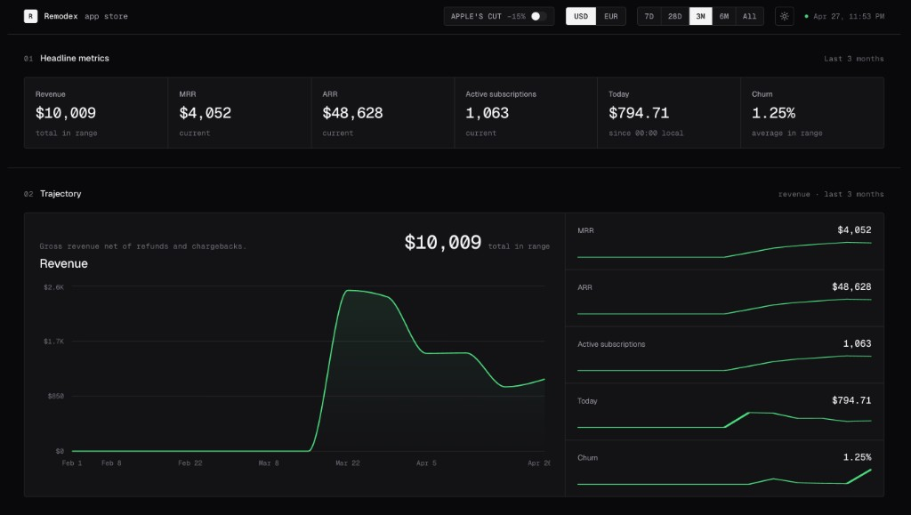

# RC Dashboard

A minimal, Codex/Cursor-style RevenueCat operator console built on Next.js + shadcn.

Read-only dashboard with longer date ranges than RevenueCat's default 28-day view, an interactive Recharts trajectory plot, and an opt-in net-in-pocket calculator for Italian forfettario taxpayers.



## Features

- Headline KPIs: Revenue, MRR, ARR, Active subscriptions, **Today** (since local midnight, timezone-aware), Churn
- Interactive trajectory chart (hover for daily values) plus side mini-charts for every other metric
- Date ranges: 7d / 28d / 3m / 6m / All-time
- USD / EUR currency toggle (EUR is converted locally from a live ECB-backed FX rate to avoid duplicate RevenueCat chart requests)
- Apple's 15% cut toggle (display gross or net everywhere a currency value is rendered)
- Light + dark mode with no flash on first paint
- All filter state persisted in the URL (shareable links) and in localStorage
- 60s in-memory client cache to skip repeated API calls
- **Optional**: Italian forfettario tax calculator behind Settings → Italian taxes

## Setup

Create `.env.local` from `.env.example`:

```bash
REVENUECAT_API_KEY=your_read_only_secret_key
REVENUECAT_PROJECT_ID=
REVENUECAT_CURRENCY=USD
NEXT_PUBLIC_USD_TO_EUR_RATE=0.92
```

Never commit a real RevenueCat secret key. `.env.local` and every `.env.*` file are gitignored; only `.env.example` (with placeholders) is allowed in the repo.

`REVENUECAT_PROJECT_ID` is optional. When empty the app calls `/v2/projects` and uses the first project available to the API key.

The app fetches RevenueCat data in USD once per range, then converts currency-shaped values in the browser so switching EUR does not hit the RevenueCat chart rate limit. `/api/fx` retrieves the USD→EUR rate from Frankfurter's ECB-backed feed and caches it server-side; `NEXT_PUBLIC_USD_TO_EUR_RATE` is only the fallback if that lookup fails.

## RevenueCat permissions

Use a restricted key with read-only scopes:

- `charts_metrics:overview:read`
- `charts_metrics:charts:read`
- `project_configuration:projects:read` (only if you want automatic project discovery)

The API key never reaches the browser. Client requests go to `/api/revenuecat`, and that server route is the only thing that talks to RevenueCat.

## Run

```bash
npm install
npm run dev
```

Without `.env.local`, the dashboard renders deterministic demo data so the UI stays inspectable.

## Italian taxes (optional)

The repo ships with this feature **disabled by default** so the dashboard stays generic. Open the gear icon in the topbar and flip **Italian taxes** to enable a side drawer that estimates net-in-pocket revenue under the Italian forfettario regime (67% coefficient, sviluppo software).

What it covers:

- Apple commission tier (15% Small Business / 30% Standard)
- Imposta sostitutiva (5% start-up / 15% a regime)
- INPS — fixed annual amount or percentage Gestione Separata (26.07% / 24%)
- RevenueCat fee (1% MTR over $2,500/month)
- IVA reverse charge 22%
- Optional extras: bollo €2 per fattura, commercialista, PEC + firma digitale, diritto annuale CCIAA

Settings persist via URL params and localStorage. A companion explainer PDF lives at `output/pdf/revenuecat-tasse-forfettario.pdf` (Italian).

## Stack

- Next.js 16 (App Router) + TypeScript
- Tailwind CSS v4 + shadcn/ui (Sheet, Switch, Popover, Chart)
- Recharts for the trajectory plot
- Geist Sans + Mono

## License

MIT — see [`LICENSE`](LICENSE).
